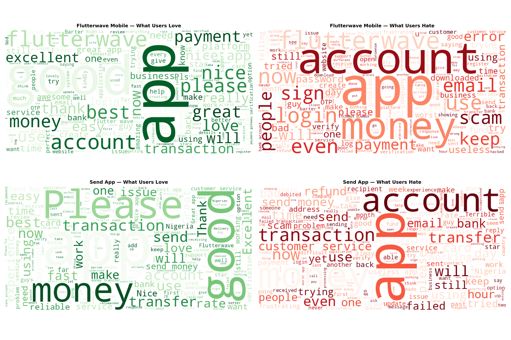
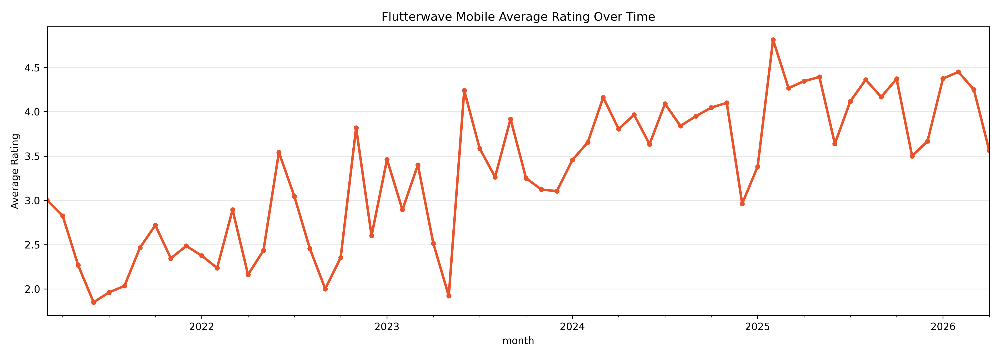

# Flutterwave AI Integration Analysis

**Independent strategic analysis | May 2026**

## Overview

This project presents an independent analysis of how Flutterwave — Africa's leading payments technology company — can deploy artificial intelligence to solve urgent user experience challenges and establish competitive advantage across Nigerian and international operations.

The analysis is grounded in:
- **3,329 Google Play Store reviews** from Flutterwave Mobile and Send App (sentiment analysis via VADER NLP)
- **75,000 Nigerian fintech reviews** across Moniepoint, Opay, and Palmpay (competitive context)
- **CBN regulatory directives** (March 2026 AI-AML mandate)
- **Documented AI failure cases** from global financial institutions

## Key Findings

- Flutterwave's lifetime Play Store ratings (4.3 / 4.5) mask a current user experience crisis (actual recent ratings: 3.26 / 2.95)
- Send App records **31% negative sentiment** — nearly 1 in 3 users dissatisfied
- Account creation failures and stuck transactions are the dominant pain points
- The CBN's June 2026 AI-AML mandate makes fraud detection AI an immediate compliance obligation
- Flutterwave's Mono acquisition (100B data points) provides the foundation for AI credit scoring

## Four AI Use Cases Identified

1. **AI-Powered Fraud Detection** — Real-time anomaly detection (CBN-mandated)
2. **Sentiment-Aware Customer Service** — Intelligent triage with human escalation
3. **AI Credit Scoring for Merchants** — Leveraging Mono's 100B financial data points
4. **Predictive Churn Detection** — Early-warning merchant retention models

## Deliverables

- 📄 [Full Report (PDF)](./flutterwave_ai_report.pdf)
- 📓 [Flutterwave Sentiment Analysis Notebook](./flutterwave_scrape_script(colab).ipynb)
- 📊 [Nigerian Fintech Competitive Analysis (75K reviews)](./moniepoint_opay_palmpay_analysis.ipynb)

## Tools & Methods

- **Python:** VADER sentiment analysis, pandas, scipy (Mann-Whitney U testing), matplotlib
- **Data Sources:** Google Play Store (google-play-scraper), Trustpilot API
- **Statistical Validation:** Mann-Whitney U pairwise comparisons (p < 0.001)
- **Visualization:** Looker Studio, matplotlib, wordcloud

## Context

This analysis was conducted independently as a demonstration of applied NLP, statistical testing, regulatory research, and strategic intelligence capabilities. Access to Flutterwave's internal transaction data would enable significantly more precise AI research.

## Author

**Patrick Maduchi**
- 📧 patrickmaduchi7@gmail.com
- 🔗 [LinkedIn](https://linkedin.com/in/maduchi-patrick-90ba27336)
- 📊 [Kaggle](https://kaggle.com/maduchipatrick)

## Visualizations

### Word Clouds

### Rating Trend

---

*Every recommendation in this report is traceable to a real user complaint. No speculative trends. Real evidence from real Flutterwave users.*
